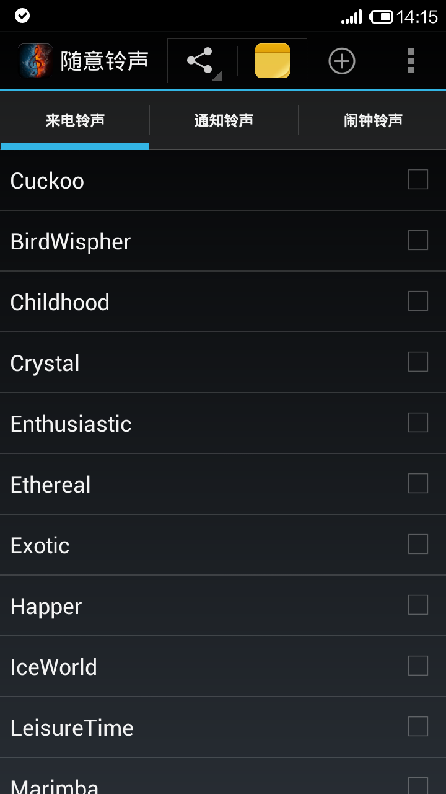
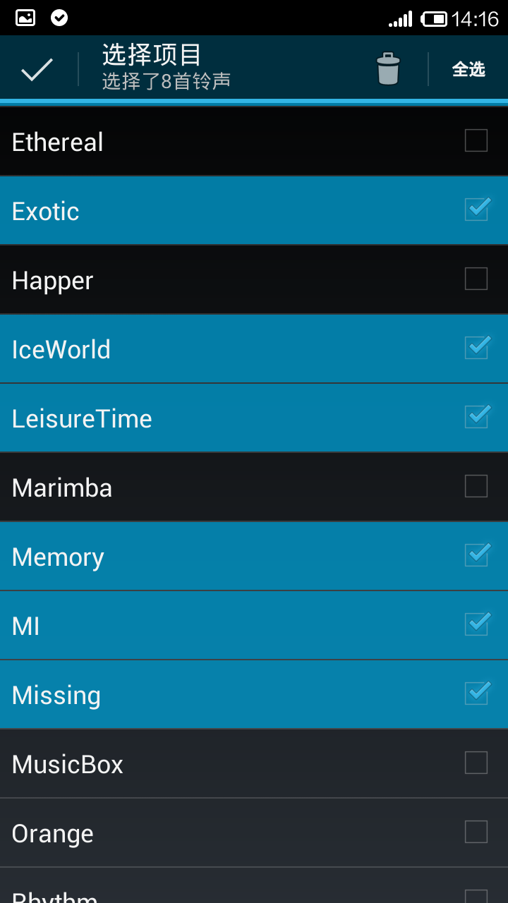
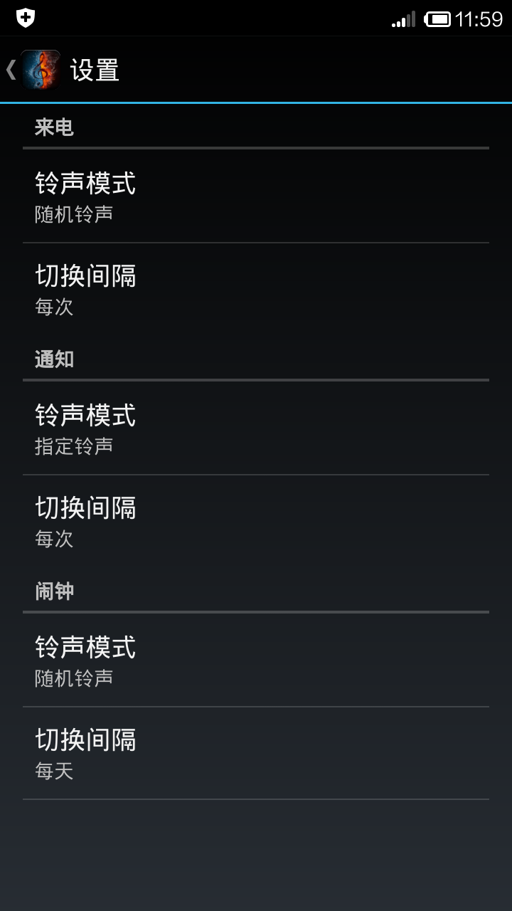
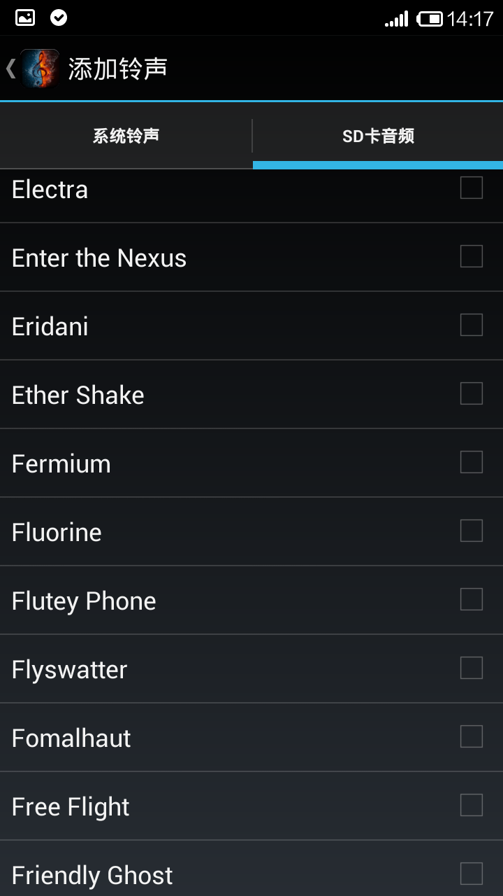

FreeRingtones
=============
随意铃声
- 来电时可以切换铃声
- 有默认、随机和循环模式
- 支持短信和闹钟切换铃声
- 支持从手机系统和存储卡中选择添加铃声
- 可以设置铃声切换间隔

TODO
----
- 优化用户界面
- 增加目录添加和删除铃声
- 添加设置默认铃声
- 优化帮助说明

App Store
---------
- 小米：http://app.mi.com/detail/56912
- 安智：http://www.anzhi.com/soft_1769159.html

Screenshots
-----------

